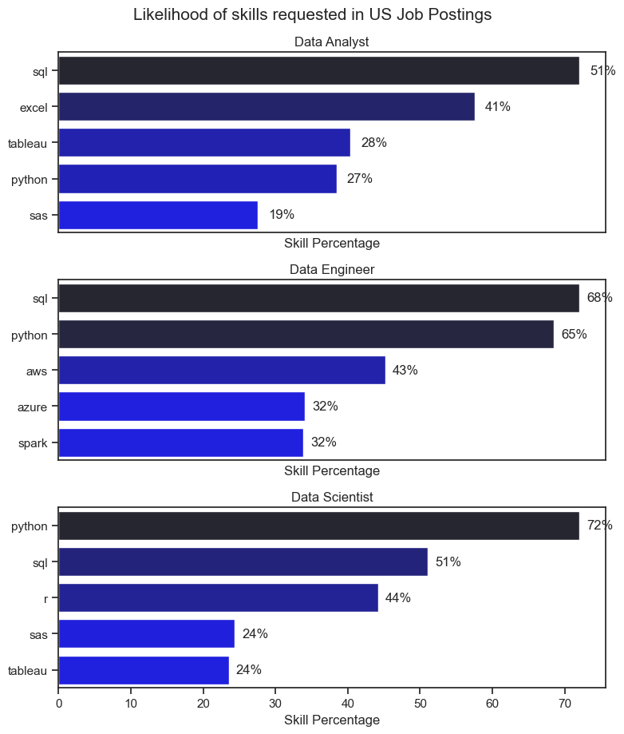
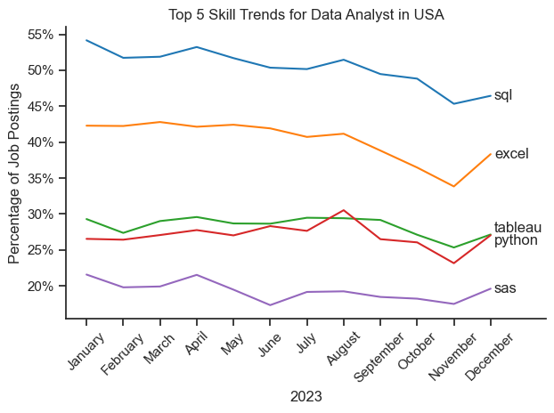
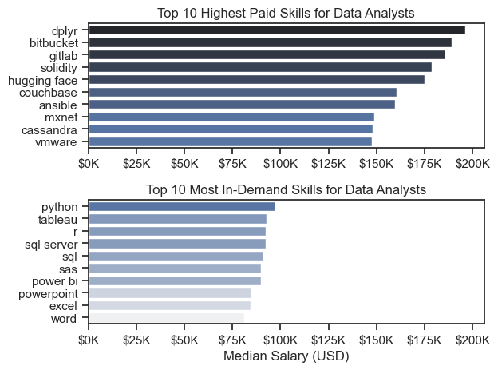

# The Analysis

## 1. What are the most demanded skills for the top 3 most popular data roles?

To find the most demanded skills for the top 3 most popular data roles. I filtered out those positions by which ones were the most popular, and got the top 5 skills for these top 3 roles. This query highlights the most popular job titles and their top skills, showing which skills I should pay attention to depending on the role I'm targeting.

View my notebook with detailed steps here : [2.Skills_count.ipynb] (Python Project\2.Skills_count.ipynb)

### Visualize data

```python
fig, ax = plt.subplots(len(job_titles), 1)

for i, job_title in enumerate(job_titles):
    df_plot = df_skills_perc[df_skills_perc['job_title_short'] == job_title].head(5)[::-1]
    sns.barplot(data=df_plot, x='skill_percent', y='job_skills', ax=ax[i], hue='skill_count', palette='dark:b_r')

plt.show()
```
# Results 
[Visualization of top skills for Data Roles]



# Insights
- SQL is the most requested skill for Data Analysts and Data Scientists, with it in over half the job postings for both roles. For Data Engineers, Python is the most sought-after skill, appearing in 68% of job postings.
- Data Engineers require more specialized technical skills (AWS, Azure, Spark) compared to Data Analysts and Data Scientists who are expected to be proficient in more general data management and analysis tools (Excel, Tableau).
- Python is a versatile skill, highly demanded across all three roles, but most prominently for Data Scientists (72%) and Data Engineers (65%).

## 2. How are in-demand skills trending for Data Analysts?

To find how skills are trending in 2023 for Data Analysts, I filtered data analyst positions and grouped the skills by the month of the job postings. This got me the top 5 skills of data analysts by month, showing how popular skills were throughout 2023.

View my notebook with detailed steps here: [3.Skills_Trend.ipynb] (Python Project\3.Skills_Trend.ipynb)

```python
sns.set_theme(style='ticks')
plot = df_percentage.iloc[:, :5]
sns.lineplot(data=plot, dashes=False, palette='tab10')
plt.title('Top 5 Skill Trends for Data Analyst in USA')
plt.xlabel('2023')
plt.ylabel('Percentage of Job Postings')
plt.xticks(rotation=45)
plt.legend().remove()
plt.gca().yaxis.set_major_formatter(mtick.PercentFormatter(decimals=0))
offsets = {
    'tableau': 0.8,
    'python': -0.8 
}
for col in plot.columns:
    last_val = plot[col].iloc[-1]
    y_pos = last_val + offsets.get(col, 0) 
    plt.text(11.1, y_pos, col, va='center')
plt.xlim(right=12.5) 
sns.despine()
plt.tight_layout()
plt.show()

```
### Results


# 3. How well do jobs and skills pay for Data Roles?

To identify the highest-paying roles and skills, I only got jobs in the United States and looked at their median salary. But first I looked at the salary distributions of common data jobs like Data Scientist, Data Engineer, and Data Analyst, to get an idea of which jobs are paid the most.

### Salary Analysis

```python
sns.boxplot(data=df_us_6, x='salary_year_avg', y='job_title_short', order= joborder)
sns.set_theme(style='ticks')
plt.title('Salary distributions in USA')
plt.xlabel('Yearly Salary in USD')
plt.ylabel('')
plt.xlim(0, 600000)
ticks_x = plt.FuncFormatter(lambda y, pos: f'${int(y/1000)}K')
plt.gca().xaxis.set_major_formatter(ticks_x)
plt.show()
```

### Insights
- There's a significant variation in salary ranges across different job titles. Senior Data Scientist positions tend to have the highest salary potential, with up to $600K, indicating the high value placed on advanced data skills and experience in the industry.

- Senior Data Engineer and Senior Data Scientist roles show a considerable number of outliers on the higher end of the salary spectrum, suggesting that exceptional skills or circumstances can lead to high pay in these roles. In contrast, Data Analyst roles demonstrate more consistency in salary, with fewer outliers.

- The median salaries increase with the seniority and specialization of the roles. Senior roles (Senior Data Scientist, Senior Data Engineer) not only have higher median salaries but also larger differences in typical salaries, reflecting greater variance in compensation as responsibilities increase.

### Highest Paid & Most Demanded Skills for Data Analysts

```python
fig, ax = plt.subplots(2,1)

sns.set_theme(style="ticks")


sns.barplot(data= df_da_toppay, x = 'median', y = df_da_toppay.index, ax=ax[0], hue = 'median', palette = 'dark:b_r' )
ax[0].legend().remove()
ax[0].set_title('Top 10 Highest Paid Skills for Data Analysts')
ax[0].set_ylabel('')
ax[0].set_xlabel('')
ax[0].xaxis.set_major_formatter(plt.FuncFormatter(lambda x, _: f'${int(x/1000)}K'))

df_da_skills = df_da_skills.sort_values(by='median', ascending=False)


sns.barplot(
    data=df_da_skills,
    x='median',
    y=df_da_skills.index,
    ax=ax[1],
    hue='median',
    palette='light:b',
)
ax[1].legend().remove()
ax[1].set_title('Top 10 Most In-Demand Skills for Data Analysts')
ax[1].set_ylabel('')
ax[1].set_xlabel('Median Salary (USD)')
ax[1].set_xlim(ax[0].get_xlim())
ax[1].xaxis.set_major_formatter(
    plt.FuncFormatter(lambda x, _: f'${int(x/1000)}K')
)
plt.tight_layout()
plt.show()
```
### Results



### Insights

- The top graph shows specialized technical skills like dplyr, Bitbucket, and Gitlab are associated with higher salaries, some reaching up to $200K, suggesting that advanced technical proficiency can increase earning potential.

- The bottom graph highlights that foundational skills like Excel, PowerPoint, and SQL are the most in-demand, even though they may not offer the highest salaries. This demonstrates the importance of these core skills for employability in data analysis roles.

- There's a clear distinction between the skills that are highest paid and those that are most in-demand. Data analysts aiming to maximize their career potential should consider developing a diverse skill set that includes both high-paying specialized skills and widely demanded foundational skills.